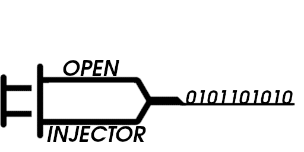

# Openinjector
 <br />
Openinjector is a framework aimed to analyse and report critical sections of binaries executable(ELF) on linux.
## Features
Openinjector supports:
* Single injection method
* Data collection on final execution of faulted binary
* Statistics on the whole process
* SEU Diagram generation with python script support
## Compiling the software
The code is written in C++, in order to compile it you have just to:
```make configure compile```
* ```configure``` will download sandboxed-api library from google  (Apache2)
* ```compile``` will compile the binary executable called ```openinjector```

## Usage
```./openinjector <binary_executable_name>```

## Testing fault injection
In ```utils/faulted_programs``` there are plenty of C codes that can be faulted and tested. The procedure is the sequent:
1. compile the codes with ```bash compile.sh <c_code> [<output_name>]```
2. use objdump to get disassembly of code ```objdump -S <binary_executable> > output.txt```
3. use cat to get instruction code that we want to inject ```cat output.txt | grep int main```
4. now with a software (Okteta) get the decimal representation of the address referring to the instruction by searching the instruction hex.

WARNING: Currently only support for static binaries

Since sandboxed api from google follows live at head philosphy, this framework cannot be built and installed as a Shared Object .so...
In order to use this, then you have only to assemble the program in the main.cpp and make it run.
C++ 17 IS STRONGLY NEEDED FOR CRAFTING POLICIES OTHERWSIE IT WILL THROW 
BAD_ALLOC ERROR
